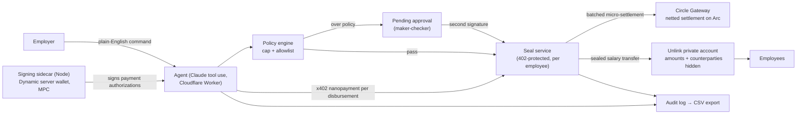

<!-- logo lockup: assets/logo.svg (dropped in by hand; referenced once it lands) -->
# Manila

*The pay envelope, rebuilt onchain.*

For a century, salaries were private because they came in a sealed manila envelope. Public chains broke that — which is why stablecoin payroll adoption sits under 1%: nobody wants their salary on a public ledger. Manila brings the envelope back. An employer funds a payroll treasury; an AI agent drafts and executes runs from plain-English commands; a policy engine (per-run cap + recipient allowlist) gates every execution, with over-threshold runs halting for human approval — two signatures on the envelope. Disbursements settle as batched, gas-free USDC micropayments on Arc via Circle Gateway, **sealed** by Unlink so amounts and counterparties stay confidential. Everything is recorded to an employer-only exportable audit trail — open the envelope.

> Built solo at ETHGlobal New York 2026.

## Architecture



Two legs per payroll run. The **value leg** is sealed: salaries move as Unlink private transfers — amounts and counterparties unreadable on ArcScan. The **nanopayment leg** is the meter: the agent pays a $0.001 x402 micropayment per disbursement to the seal service, each authorization signed by the Dynamic server wallet (the agent holds no keys), all of them netted by Circle Gateway into one batched, gas-free settlement on Arc. No payment, no seal: every sponsor integration is load-bearing.

## How we use each sponsor

*(Filled in per milestone — each subsection states what the integration does here, why the product breaks without it, and file/line pointers.)*

- **Dynamic** — server wallet (MPC) in a Node sidecar (`sidecar/server.mjs`; the SDK's native MPC binary can't run in workerd). The Worker requests signatures over an authenticated channel (`src/lib/signer.ts`); the agent itself never holds key material. *(M1)*
- **Unlink** — every disbursement is sealed; amounts and counterparties unreadable on the explorer. *(M1)*
- **Circle Gateway / Arc** — batched gas-free USDC micro-settlement on Arc testnet. *(M1)*
- **Dynamic Flow** — fund the treasury with any supported token, settle USDC. *(M4)*

## Privacy model

Confidential to the public: payment amounts and counterparties (sealed via Unlink).
Auditable to the employer: the complete run history, policy decisions, and settlement references (CSV export).
That split — public confidentiality, private auditability — is the compliance-correct shape for payroll.

## Run it

```sh
npm install
cp .dev.vars.example .dev.vars     # fill in keys (see comments in the file)
npx wrangler d1 create manila      # put the returned database_id in wrangler.jsonc
npm run db:migrate:local && npm run db:seed:local
npm run dev                        # http://localhost:8787
# deploy:
npm run db:migrate:remote && npm run db:seed:remote
npm run deploy
```

## Demo script

*(90-second path — written at M3.)*

## Known limitations

*(Maintained honestly as we go.)*

## AI assistance

Per ETHGlobal's AI usage guidelines: this project was built with Claude Code as a development assistant. It generated most of the scaffolding and boilerplate (Worker/D1 setup, schema, frontend markup) and assisted with implementation and debugging of the integration code throughout. The product concept, architecture, sponsor-integration design, policy model, brand system, and final testing and review are my own work, and all code was directed and reviewed by me.
