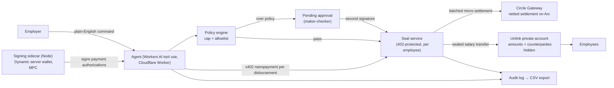

<!-- logo lockup: assets/logo.svg (dropped in by hand; referenced once it lands) -->
# Manila

*The pay envelope, rebuilt onchain.*

For a century, salaries were private because they came in a sealed manila envelope. Public chains broke that — which is why stablecoin payroll adoption sits under 1%: nobody wants their salary on a public ledger. Manila brings the envelope back. An employer funds a payroll treasury; an AI agent drafts and executes runs from plain-English commands; a policy engine (per-run cap + recipient allowlist) gates every execution, with over-threshold runs halting for human approval — two signatures on the envelope. Disbursements settle as batched, gas-free USDC micropayments on Arc via Circle Gateway, **sealed** by Unlink so amounts and counterparties stay confidential. Everything is recorded to an employer-only exportable audit trail — open the envelope.

> Built solo at ETHGlobal New York 2026.

## Architecture



Two legs per payroll run. The **value leg** is sealed: salaries move as Unlink private transfers — amounts and counterparties unreadable on ArcScan. The **nanopayment leg** is the meter: the agent pays a $0.001 x402 micropayment per disbursement to the seal service, each authorization signed by the Dynamic server wallet (the agent holds no keys), all of them netted by Circle Gateway into one batched, gas-free settlement on Arc. No payment, no seal: every sponsor integration is load-bearing.

The agent itself runs on **Cloudflare Workers AI** (`@cf/meta/llama-3.3-70b-instruct-fp8-fast`) via a function-calling loop — it parses the plain-English instruction and drafts the run; the policy gate and the execute-vs-approve branch are deterministic by design, so an LLM can never talk its way past a cap (`src/lib/agent.ts`, `src/lib/policy.ts`).

## How we use each sponsor

Each integration is load-bearing — remove it and the product stops working, not just loses a feature.

- **Dynamic** (Best Agentic Build, Best Money App, joint Private Nanopayments) — a Dynamic server wallet (MPC) is the treasury and the agent's signer. It lives in a Node sidecar (`sidecar/server.mjs`; the SDK's native MPC binary can't run in workerd) and signs every Gateway payment authorization over an authenticated channel (`src/lib/signer.ts`). The agent decides and executes, but holds no key material — the wallet signs on its behalf under the maker-checker controls.
- **Unlink** (joint Private Nanopayments) — every salary is sealed: each disbursement is an Unlink private transfer, so amounts and counterparties are unreadable on ArcScan (`src/lib/unlink.ts`, `src/routes/seal.ts`). This is the product's whole reason to exist; without it, payroll is public.
- **Circle Gateway + Arc** (Best Agentic Economy, joint Private Nanopayments) — disbursements are metered as x402 nanopayments and netted by Circle Gateway into one batched, gas-free settlement on Arc testnet (`src/routes/seal.ts`, `src/routes/disburse.ts`). The agent paying per-call for each sealed disbursement is exactly the agent-to-service commerce pattern the Agentic Economy track is for.

## Roadmap

Beyond the core, two extensions deepen specific sponsor tracks:

- **Flow-funded treasury** (Dynamic, Best Use of Flow) — fund the treasury with any supported token and settle to USDC, with a webhook marking the treasury funded. Gated on Flow testnet availability.
- **On-chain vesting vault** (Arc, Advanced Stablecoin Logic) — a `PayrollVault` Solidity contract on Arc with scheduled USDC releases (cliff + linear), the agent wallet calling `release()`, events feeding the same audit trail — routing at least one employee's pay through programmable on-chain logic.

## Privacy model

Confidential to the public: payment amounts and counterparties (sealed via Unlink).
Auditable to the employer: the complete run history, policy decisions, and settlement references (CSV export).
That split — public confidentiality, private auditability — is the compliance-correct shape for payroll.

## Run it

```sh
npm install
npx wrangler login                 # the agent uses Workers AI — no LLM key needed
npx wrangler d1 create manila      # put the returned database_id in wrangler.jsonc
npm run db:migrate:local && npm run db:seed:local
npm run dev                        # http://localhost:8788
```

The agent panel works immediately on this alone — type **"Run June payroll with a 25% bonus"** and watch it draft the run, fail the policy cap, and route it for a second signature; click **Add second signature** to release. Then **Open the envelope** exports the full audit trail as CSV.

To exercise the live money path (real Arc testnet settlement), add sponsor credentials and bring up the signer + private accounts:

```sh
cp .dev.vars.example .dev.vars     # DYNAMIC_API_KEY/ENV_ID, UNLINK_API_KEY, SEAL_FEE_ADDRESS…
node sidecar/server.mjs            # prints the treasury address → fund at faucet.circle.com (Arc Testnet)
node scripts/setup-unlink.mjs      # creates + registers the Unlink accounts, prints the D1 updates to apply
# deploy:
npm run db:migrate:remote && npm run db:seed:remote && npm run deploy
```

## Prize entries

- **Private Nanopayments** (Dynamic × Arc × Unlink, joint) — all three as core: Dynamic server wallet signs the authorizations, Circle Gateway batches the settlement on Arc, Unlink seals every salary.
- **Dynamic — Best Agentic Build** — the agent uses a Dynamic server wallet to sign and execute on-chain disbursements, deciding then executing under maker-checker controls.
- **Dynamic — Best Money App** — confidential USDC payroll: a real money-movement app built on a Dynamic SDK.
- **Arc — Best Agentic Economy with Circle Agent Stack** — an agent paying gas-free per-disbursement nanopayments on Arc; frontend + backend + this README's architecture.
- *(Roadmap)* **Dynamic — Best Use of Flow** and **Arc — Advanced Stablecoin Logic**, per the Roadmap section.

## Demo script (90 seconds)

1. **The problem** (10s) — salaries on a public chain are exposed; that's why stablecoin payroll adoption is under 1%.
2. **Run payroll** (20s) — type "Run the June payroll." The agent drafts it, policy passes, and it seals — `Sealed. 3 payments. $0.003 in fees.`
3. **The seal** (20s) — open ArcScan: the settlement is there, but amounts and counterparties are not readable. That's Unlink.
4. **The control** (25s) — type "Run June payroll with a 25% bonus." It trips the per-run cap and halts: `PENDING APPROVAL`. Click **Add second signature** — now it releases. Two signatures on the envelope.
5. **The audit** (15s) — **Open the envelope**: every instruction, policy decision, and settlement reference exports as CSV. Confidential to the public, fully auditable to the employer.

## Known limitations

- The Dynamic MPC signer runs in a Node sidecar (`sidecar/server.mjs`) because the SDK ships a native binary that can't load in Cloudflare Workers; for judging it runs alongside the Worker rather than fully on the edge.
- The agent runs on the best free function-calling model on Workers AI (Llama 3.3 70B). It reliably parses intent and drafts; the policy gate and execute/approve branch are deterministic on purpose, so model variance can't affect correctness or bypass a control.
- Demo amounts are dollars, not thousands, because the Arc faucet grants 20 USDC per address per 2h — every transaction is real testnet value.

## AI assistance

Built spec-driven with Claude Code per ETHGlobal's AI usage guidelines. The pre-build project brief — product, architecture, integration requirements, milestone gates — is committed at [docs/SPEC.md](docs/SPEC.md); Claude Code generated most of the code working from it, with design decisions, checkpoint review, and all sponsor-account operations by me. Full attribution, including a per-directory map of AI-generated vs. human-authored work, is in [docs/AI_USAGE.md](docs/AI_USAGE.md).
