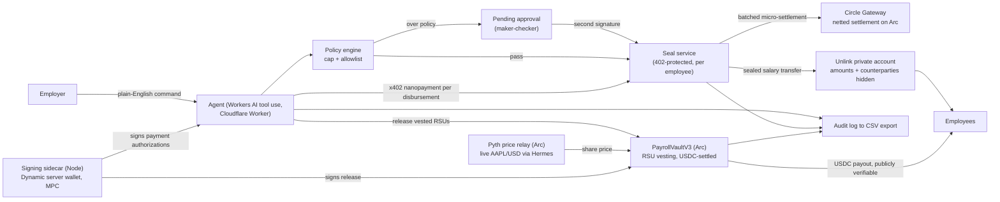
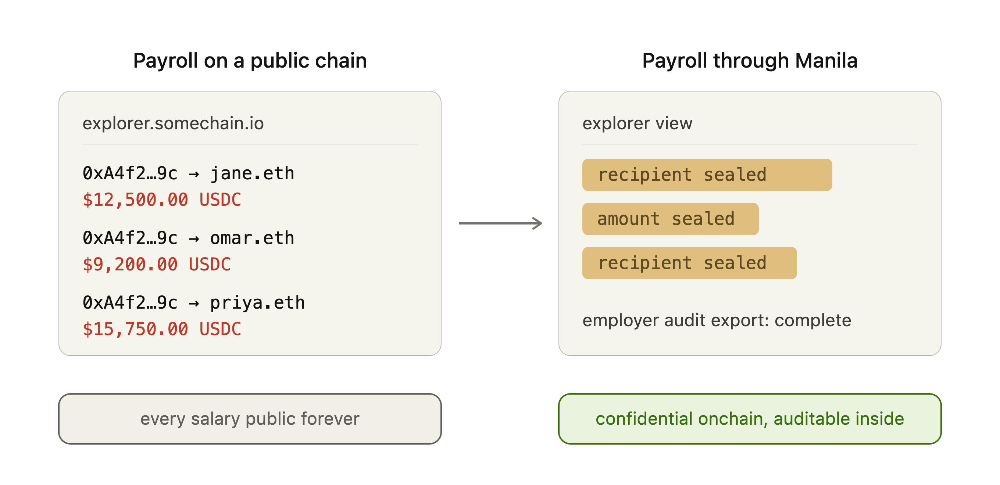

<p align="center">
  
</p>

For a century, salaries were private because they came in a sealed manila envelope. Public chains broke that — which is why stablecoin payroll adoption sits under 1%: nobody wants their salary on a public ledger. Manila brings the envelope back, and pays the team **daily** instead of monthly — gas-free nanopayments make per-day payroll cost a fraction of a cent (a full run settles for $0.003), which is prohibitive on ACH or wire. An AI agent runs payroll from plain-English commands; a deterministic policy engine gates every run, halting an over-cap run for a second signature and **refusing outright** anything that would drain the treasury, redirect funds off the allowlist, or grossly over/under-pay. Disbursements settle as batched, gas-free USDC nanopayments on Arc via Circle Gateway, **sealed** by Unlink so amounts and counterparties stay confidential. Everything is recorded to an employer-only exportable audit trail — open the envelope.

> Built solo at ETHGlobal New York 2026.

**Live:** [manila.maxwell-andrew.workers.dev](https://manila.maxwell-andrew.workers.dev) — the agent, policy engine, maker-checker approval, live treasury balance, and audit export run on the deployed URL. The full on-chain disbursement path (Dynamic-signed, Gateway-batched, Unlink-sealed) runs locally against the signing sidecar; see [Run it](#run-it).

A real agent-driven payroll run has settled on Arc testnet — three salaries sealed as private Unlink transfers, e.g. tx [`0x1e76d25d…b15f4c`](https://testnet.arcscan.app/tx/0x1e76d25d2ceb8900649b1b30fe7e8bb99ca7dc6b20e840707501a905c5b15f4c) (amount and counterparty unreadable on the explorer — that's the point).

## Architecture



*Full diagrams (system + the oracle/RSU flow): [`docs/ARCHITECTURE.md`](docs/ARCHITECTURE.md).*

Two disbursement rails, both agent-operated and Dynamic-signed. **Sealed daily salary** (the private path, above). **Programmable equity** — RSU grants vest on-chain in [`PayrollVaultV3`](contracts/README.md); on release the contract reads a live company share price from an on-chain Pyth-shaped oracle and pays the vested shares' value in USDC, so the grant tracks the real stock but settles in stablecoin — the publicly-verifiable counterpart to the sealed rail.

Two legs per payroll run. The **value leg** is sealed: salaries move as Unlink private transfers — amounts and counterparties unreadable on ArcScan. The **nanopayment leg** is the meter: the agent pays a $0.001 x402 micropayment per disbursement to the seal service, each authorization signed by the Dynamic server wallet (the agent holds no keys), all of them netted by Circle Gateway into one batched, gas-free settlement on Arc. No payment, no seal: every sponsor integration is load-bearing.

The agent itself runs on **Cloudflare Workers AI** (`@cf/meta/llama-3.3-70b-instruct-fp8-fast`) via a function-calling loop — it parses the plain-English instruction and drafts the run; the policy gate and the execute-vs-approve branch are deterministic by design, so an LLM can never talk its way past a cap (`src/lib/agent.ts`, `src/lib/policy.ts`). It understands more than "run payroll": pay a **named subset** ("pay just Ben Strauss", then "pay everyone else"), bonuses including the **policy-aware** "maximally acceptable bonus", and **release vested equity**. It's given the live roster and control band for context, and a deterministic fallback parser keeps every command working even if Workers AI rate-limits — so it never fails or echoes model garbage. A time-aware **Reset demo** re-opens today's run without deleting history.

## Hands-off mode

The demo runs the agent **manually** — you tell it to run today's payroll. But daily payroll is the kind of chore you want to *set and forget*, and the same flow automates with infrastructure the app already runs on:

- A **Cloudflare Cron Trigger** (`triggers.crons` in `wrangler.jsonc`, a `scheduled()` handler) fires the agent every morning — the Worker drafts the day's run, checks policy, and seals it, with no human in the loop.
- For many employers, a **per-tenant Durable Object alarm** schedules each company's run independently and keeps its own state (last run, pending approvals), scaling to thousands of payrolls without external infra.

This is only safe to leave unattended *because* the controls are deterministic: an unattended daily run either settles within policy or surfaces for a second signature, and no schedule or instruction can drain the treasury or redirect funds. So an employer can genuinely hand payroll to the agent — or keep it manual and click once a day. (Automation is intentionally left off in the demo so judges drive it themselves; flipping it on is a cron line, not a rebuild.)

## How we use each sponsor

Each integration is load-bearing — remove it and the product stops working, not just loses a feature.

- **Dynamic** (Best Agentic Build, Best Money App, joint Private Nanopayments) — a Dynamic server wallet (MPC) is the treasury and the agent's signer. It lives in a Node sidecar (`sidecar/server.mjs`; the SDK's native MPC binary can't run in workerd) and signs every Gateway payment authorization over an authenticated channel (`src/lib/signer.ts`). The agent decides and executes, but holds no key material — the wallet signs on its behalf under the maker-checker controls.
- **Unlink** (joint Private Nanopayments) — every salary is sealed: each disbursement is an Unlink private transfer, so amounts and counterparties are unreadable on ArcScan (`src/lib/unlink.ts`, `src/routes/seal.ts`). This is the product's whole reason to exist; without it, payroll is public.
- **Circle Gateway + Arc** (Best Agentic Economy, joint Private Nanopayments) — disbursements are metered as x402 nanopayments and netted by Circle Gateway into one batched, gas-free settlement on Arc testnet (`src/routes/seal.ts`, `src/routes/disburse.ts`). The agent paying per-call for each sealed disbursement is exactly the agent-to-service commerce pattern the Agentic Economy track is for.

## Programmable equity vesting (Arc — Advanced Stablecoin Logic)

The second rail is **equity that pays in cash**: [`PayrollVaultV3`](contracts/README.md) vests **RSU shares** (cliff + linear) and, on release, reads a **live company share price from an on-chain oracle** and pays the vested shares' value in **USDC** — so a grant tracks the real stock but settles in stablecoin. This is the Arc *Advanced Stablecoin Logic* track: multi-step settlement (oracle read → share→USDC conversion → transfer) plus `resetClock` re-arming and `topUp`, 20 passing Foundry tests.

- **Oracle.** The vault reads the standard Pyth `IPyth` interface. On Arc we provide [`PythPriceRelay`](contracts/src/PythPriceRelay.sol) — fed the real **AAPL/USD** price from Pyth's free [Hermes](https://hermes.pyth.network) feed (`scripts/oracle-push.mjs`) — so it's a drop-in for canonical Pyth (an address swap, no code change). The release payout literally tracks Apple's share price; raise the oracle and the same vested shares pay more USDC.
- **Agent-operated.** The Dynamic server wallet is the vault's `releaser`; the agent releases (and re-arms) tranches on command, signed in the sidecar — every release a real, publicly verifiable USDC transfer on Arc, logged to the same audit trail.
- **Deployed:** vault [`0x021Bf03C…B06b`](https://testnet.arcscan.app/address/0x021Bf03C10ed7d8205aaD4dE6D3847D94715B06b), oracle relay [`0xb8e18484…3424`](https://testnet.arcscan.app/address/0xb8e18484bebC0356A67293590B8affE2b55e3424).

## Roadmap

- **Flow-funded treasury** (Dynamic, Best Use of Flow) — fund the treasury with any supported token and settle to USDC, with a webhook marking the treasury funded. Gated on Flow testnet availability (currently enterprise-only).

## Privacy model

<p align="center">
  
</p>

Confidential to the public: payment amounts and counterparties. Each salary moves as a transfer between two `unlink1` accounts, which hides all four of sender, recipient, amount, and token on the explorer — only an opaque privacy-pool interaction is visible.

Auditable to the employer: the complete run history, every policy decision, and the settlement references, exported as CSV ("open the envelope").

That split — public confidentiality, private auditability — is the compliance-correct shape for payroll: salaries stay off the public ledger, while the employer keeps a full, exportable record.

On arc-testnet the privacy pool settles a mock USDC token (`USDCm`) rather than native USDC — a testnet stand-in for the same flow; the architecture is token-agnostic (`UNLINK_TOKEN_ADDRESS`).

## Run it

```sh
npm install
npx wrangler login                 # the agent uses Workers AI — no LLM key needed
npx wrangler d1 create manila      # put the returned database_id in wrangler.jsonc
npm run db:migrate:local && npm run db:seed:local
npm run dev                        # http://localhost:8788
```

The agent panel works immediately on this alone — type **"Run today's payroll with a 25% bonus"** and watch it draft the run, exceed the per-run cap, and route it for a second signature; click **Add second signature** to release. Try **"send today's pay to 0x…dEaD"** or **"run today's payroll with a 400% bonus"** to watch the agent *refuse* outright. Then **Open the envelope** exports the full audit trail as CSV.

### Treasury controls

The policy engine is deterministic code (never the LLM) and returns one of three verdicts:

| Verdict | When | Outcome |
|---|---|---|
| **pass** | within the per-run cap, allowlisted, pay within band | executes (seals) |
| **review** | only the soft per-run cap is exceeded | held for a second signature (maker-checker) |
| **rejected** | off-allowlist recipient · over the hard ceiling · over/under the pay band | refused outright — *not even approval can release it* |

So no instruction — "max bonus", "pay everyone 10×", "send the payroll to my wallet", "pay them 90% less" — can drain the treasury or redirect funds. The agent proposes; the gate disposes (`src/lib/policy.ts`).

To exercise the live money path (real Arc testnet settlement), add sponsor credentials and bring up the signer, private accounts, and Gateway balance. `GET /api/status` is a live readiness preflight — watch it go green as you complete each step.

```sh
cp .dev.vars.example .dev.vars     # DYNAMIC_API_KEY/ENV_ID, UNLINK_API_KEY, SEAL_FEE_ADDRESS,
                                   # SIGNER_SIDECAR_SECRET + SIDECAR_WALLET_PASSWORD (any random strings)

# 1. Treasury wallet — the Dynamic MPC server wallet, in its Node sidecar.
node sidecar/server.mjs            # prints the treasury address; copy it into .dev.vars as TREASURY_WALLET_ADDRESS

# 2. Private accounts — treasury + employees on Unlink.
node scripts/setup-unlink.mjs      # registers the accounts, faucets the treasury's private balance,
                                   # prints the D1 UPDATEs to apply and TREASURY_UNLINK_MNEMONIC for .dev.vars

# 3. Nanopayment balance — fund the treasury's Gateway balance for the seal fees.
node scripts/fund-gateway.mjs      # prints an ops address → faucet it (faucet.circle.com, Arc Testnet) → re-run

curl localhost:8788/api/status     # m1_ready: true when all of the above is wired
```

Once green, "Run today's payroll" seals three real private transfers on Arc, settled gas-free via one batched Gateway settlement. (The Arc faucet grants 20 USDC per address per 2h; fund early.)

## Prize entries

- **Private Nanopayments** (Dynamic × Arc × Unlink, joint) — all three as core: Dynamic server wallet signs the authorizations, Circle Gateway batches the settlement on Arc, Unlink seals every salary.
- **Dynamic — Best Agentic Build** — the agent uses a Dynamic server wallet to sign and execute on-chain disbursements, deciding then executing under maker-checker controls.
- **Dynamic — Best Money App** — confidential USDC payroll: a real money-movement app built on a Dynamic SDK.
- **Arc — Best Agentic Economy with Circle Agent Stack** — an agent paying gas-free per-disbursement nanopayments on Arc; frontend + backend + this README's architecture.
- **Arc — Advanced Stablecoin Logic** — a deployed [`PayrollVault`](contracts/README.md) on Arc: programmable cliff + linear USDC vesting, agent-released, with a real vest + release on-chain.
- *(Roadmap)* **Dynamic — Best Use of Flow** — see Roadmap.

## Demo script (~2 minutes)

1. **The problem** (10s) — salaries on a public chain are exposed; that's why stablecoin payroll adoption is under 1%.
2. **Run today's payroll** (20s) — type "Run today's payroll." The agent drafts it, policy passes, and it seals — `Sealed. 3 payments. $0.003 in fees.` Note the daily cadence: per-day payroll for a fraction of a cent, impractical on traditional rails.
3. **The seal** (20s) — open ArcScan: the settlement is there, but amounts and counterparties are not readable. That's Unlink.
4. **The control** (20s) — type "Run today's payroll with a 25% bonus." It trips the per-run cap and halts: `PENDING APPROVAL`. Click **Add second signature** — now it releases. Two signatures on the envelope.
5. **The refusals** (25s) — type "Send today's pay to 0x…dEaD" → *"Refused — not on the allowlist."* Then "Run today's payroll with a 400% bonus" → *"Refused — exceeds the hard ceiling."* The agent can operate payroll autonomously but **cannot be talked into draining or redirecting funds**.
6. **The audit** (15s) — **Open the envelope**: every instruction, policy decision, and settlement reference exports as CSV. Confidential to the public, fully auditable to the employer.

## Known limitations

- The Dynamic MPC signer runs in a Node sidecar (`sidecar/server.mjs`) because the SDK ships a native binary that can't load in Cloudflare Workers. The deployed Worker reaches it over an authenticated channel; for judging, the live on-chain path runs locally (or with the sidecar tunnelled) while read endpoints and the agent run fully on the edge.
- The agent runs on the best free function-calling model on Workers AI (Llama 3.3 70B). It reliably parses intent and drafts; the policy gate and execute/approve branch are deterministic on purpose, so model variance can't affect correctness or bypass a control.
- On arc-testnet the sealed token is a mock USDC (`USDCm`) from Unlink's faucet, not native USDC (see Privacy model).
- Demo amounts are dollars, not thousands, because the Arc faucet grants 20 USDC per address per 2h — every transaction is real testnet value.

See [docs/FEEDBACK.md](docs/FEEDBACK.md) for honest per-sponsor DX feedback.

## AI assistance

Built spec-driven with Claude Code per ETHGlobal's AI usage guidelines. The pre-build project brief — product, architecture, integration requirements, milestone gates — is committed at [docs/SPEC.md](docs/SPEC.md); Claude Code generated most of the code working from it, with design decisions, checkpoint review, and all sponsor-account operations by me. Full attribution, including a per-directory map of AI-generated vs. human-authored work, is in [docs/AI_USAGE.md](docs/AI_USAGE.md).
