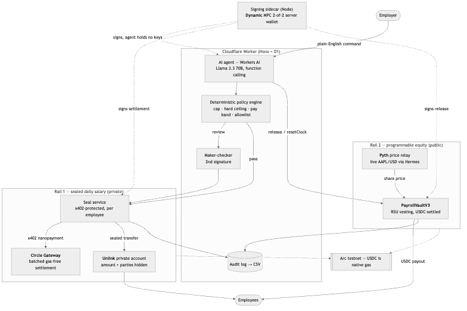
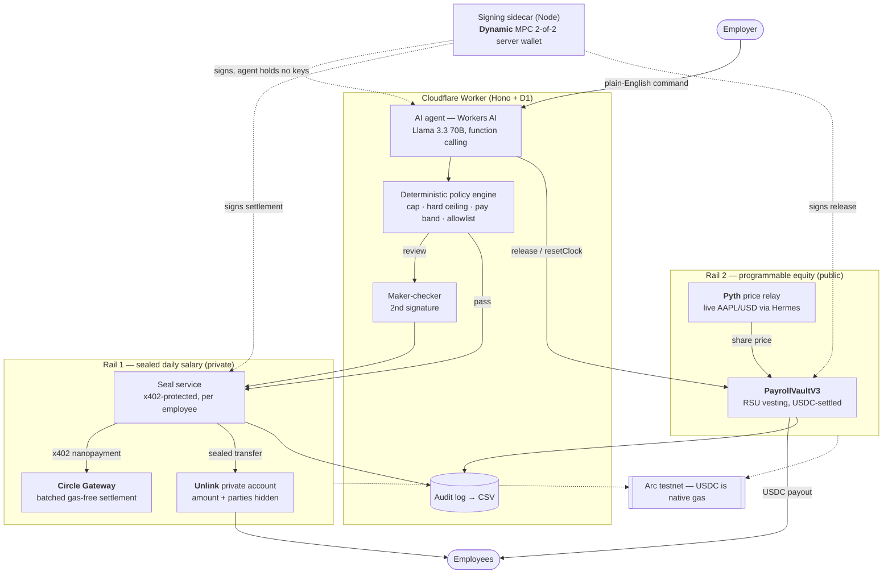
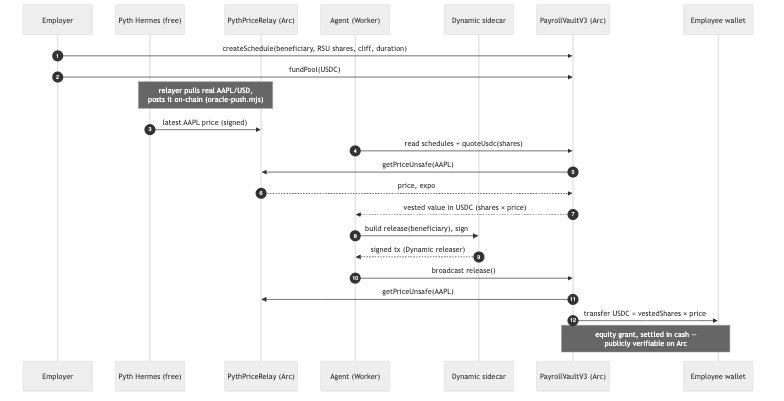
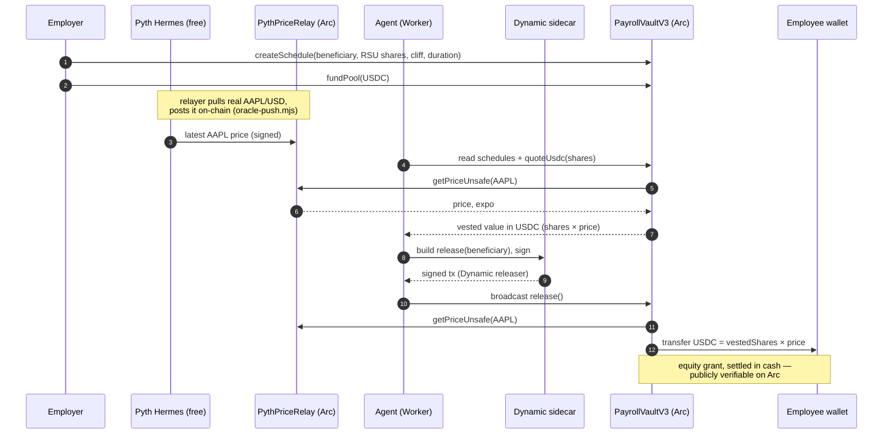

# Manila — architecture

Two diagrams: the system end-to-end, and the oracle-priced RSU vesting path in
detail. Both render on GitHub; PNG exports are in `docs/diagrams/` (see
`scripts/render-diagrams.sh`).

## System overview

## Programmable equity — oracle-priced RSU vesting

### Why a relay

`PayrollVaultV3` consumes the **standard Pyth `IPyth` interface**. Where Arc has
no canonical Pyth deployment yet, `PythPriceRelay` implements that same interface
and is fed real prices from Pyth's Hermes service. Pointing the vault at a native
Pyth contract later is a constructor address change — zero contract edits.
